# job4j_todo

## О проекте

job4j_todo — это веб-приложение для управления задачами.  
Пользователь может создавать новые задачи, просматривать список всех заданий, изменять их состояние, редактировать и удалять записи.  
Приложение построено по трёхслойной архитектуре с разделением на контроллеры, сервисы и слой работы с базой данных.  
Для хранения данных используется PostgreSQL и Hibernate, а управление изменениями структуры базы данных выполняется через Liquibase.

---

## Стек технологий

- Java 17
- Spring Boot 2.7.3
- Hibernate 5.6.11.Final
- PostgreSQL 16
- PostgreSQL JDBC Driver 42.2.9
- Thymeleaf
- Bootstrap 5
- Liquibase 4.15.0
- Maven
- Lombok 1.18.30
- SLF4J
- Logback

---

## Требования к окружению

Для запуска проекта потребуется:

- Java 17
- Maven 3.8+
- PostgreSQL 16
- Git

---

## Запуск проекта

### 1. Клонировать проект

```bash
git clone git@github.com:sdmserg/job4j_todo.git
```

---

### 2. Создать базу данных

```sql
create database todo;
```

---

### 3. Настроить подключение к БД

Указать username и password PostgreSQL в файле:

```text
src/main/resources/hibernate.cfg.xml
```

---

### 4. Запустить приложение

Через Maven:

```bash
mvn spring-boot:run
```

или через IntelliJ IDEA запуском главного класса приложения.

---

### 5. Открыть приложение

```text
http://localhost:8080
```

---

## Взаимодействие с приложением

### Список всех задач

На странице отображаются:
- список задач;
- дата создания;
- статус выполнения;
- фильтрация задач.

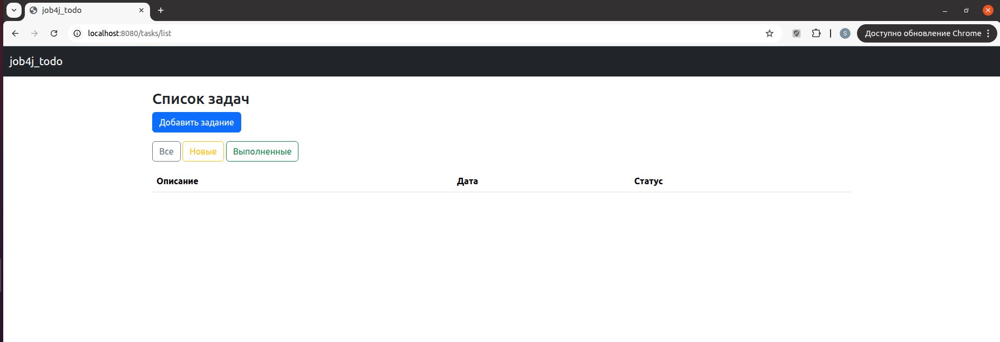

---

### Создание задачи

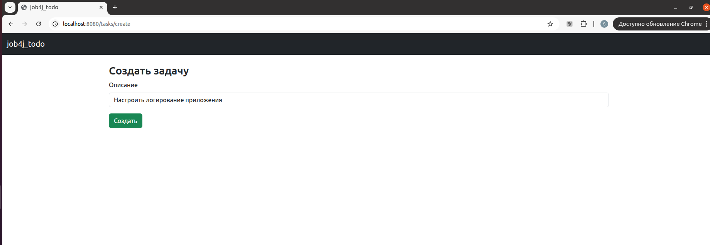

---

### Список всех задач после создания задачи

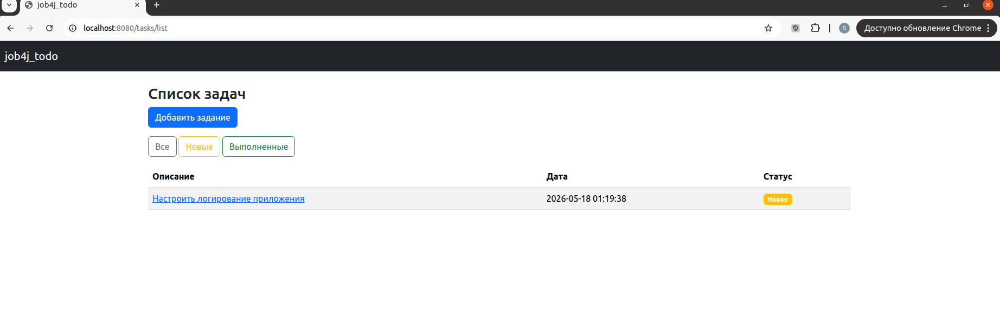

---

### Просмотр задачи

На странице доступны:
- выполнение задачи;
- редактирование;
- удаление.

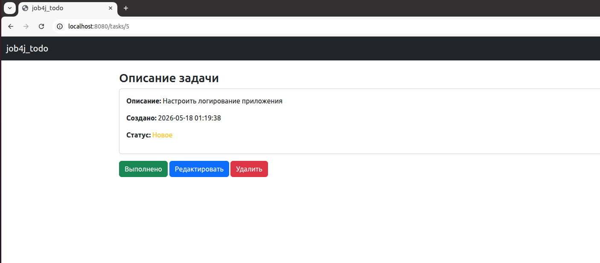

---

### Редактирование задачи

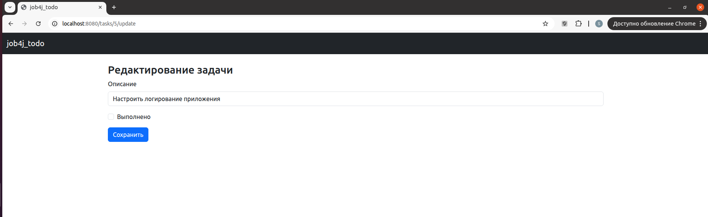

---

### Выполнение задачи

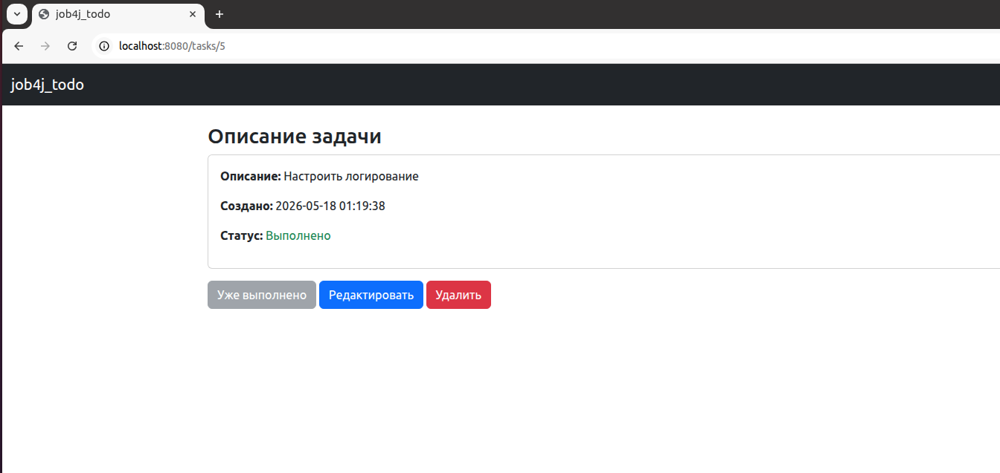

---

### Список всех задач после создания задачи

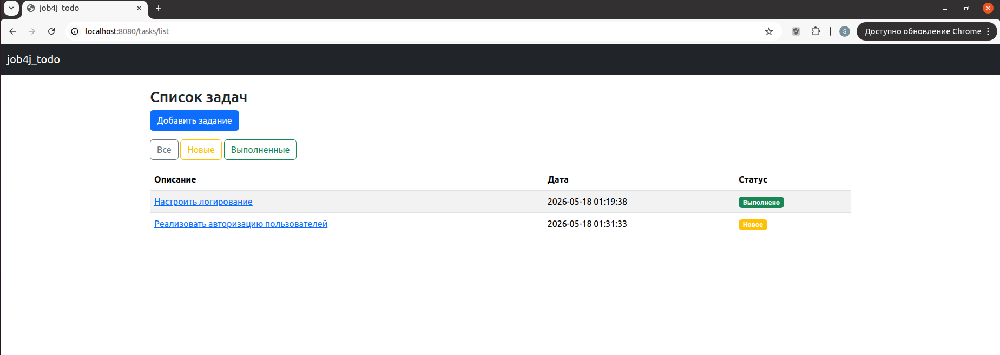


### Выполненные задачи

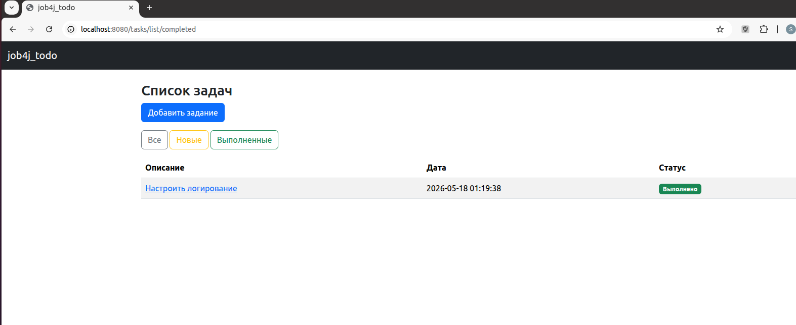

---

### Новые задачи

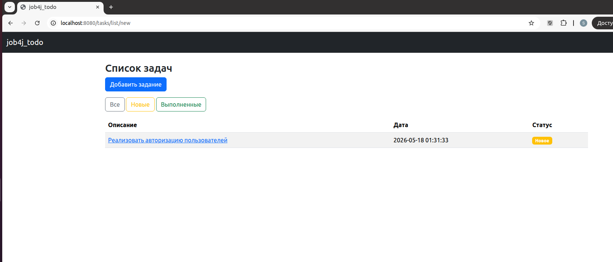

---

### Страница ошибки 404

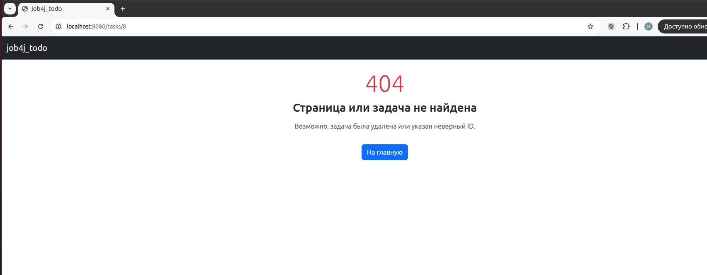

---

### Страница ошибки 500

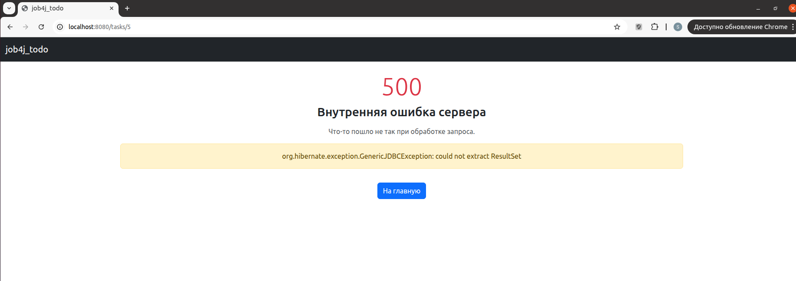

---

## Контакты

Email: sdmserg2021@gmail.com

Telegram: @sserg2025